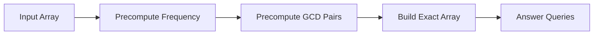

<h2><a href="https://leetcode.com/problems/sorted-gcd-pair-queries">3312. Sorted GCD Pair Queries</a></h2>

<p>You are given an integer array <code>nums</code> of length <code>n</code> and an integer array <code>queries</code>.</p>

<p>Let <code>gcdPairs</code> denote an array obtained by calculating the <span data-keyword="gcd-function" class=" cursor-pointer relative text-dark-blue-s text-sm"><button type="button" aria-haspopup="dialog" aria-expanded="false" aria-controls="radix-_r_1l_" data-state="closed" class="">GCD</button></span> of all possible pairs <code>(nums[i], nums[j])</code>, where <code>0 &lt;= i &lt; j &lt; n</code>, and then sorting these values in <strong>ascending</strong> order.</p>

<p>For each query <code>queries[i]</code>, you need to find the element at index <code>queries[i]</code> in <code>gcdPairs</code>.</p>

<p>Return an integer array <code>answer</code>, where <code>answer[i]</code> is the value at <code>gcdPairs[queries[i]]</code> for each query.</p>

<p>The term <code>gcd(a, b)</code> denotes the <strong>greatest common divisor</strong> of <code>a</code> and <code>b</code>.</p>

<p>&nbsp;</p>
<p><strong class="example">Example 1:</strong></p>

<div class="example-block">
<p><strong>Input:</strong> <span class="example-io">nums = [2,3,4], queries = [0,2,2]</span></p>

<p><strong>Output:</strong> <span class="example-io">[1,2,2]</span></p>

<p><strong>Explanation:</strong></p>

<p><code>gcdPairs = [gcd(nums[0], nums[1]), gcd(nums[0], nums[2]), gcd(nums[1], nums[2])] = [1, 2, 1]</code>.</p>

<p>After sorting in ascending order, <code>gcdPairs = [1, 1, 2]</code>.</p>

<p>So, the answer is <code>[gcdPairs[queries[0]], gcdPairs[queries[1]], gcdPairs[queries[2]]] = [1, 2, 2]</code>.</p>
</div>

<p><strong class="example">Example 2:</strong></p>

<div class="example-block">
<p><strong>Input:</strong> <span class="example-io">nums = [4,4,2,1], queries = [5,3,1,0]</span></p>

<p><strong>Output:</strong> <span class="example-io">[4,2,1,1]</span></p>

<p><strong>Explanation:</strong></p>

<p><code>gcdPairs</code> sorted in ascending order is <code>[1, 1, 1, 2, 2, 4]</code>.</p>
</div>

<p><strong class="example">Example 3:</strong></p>

<div class="example-block">
<p><strong>Input:</strong> <span class="example-io">nums = [2,2], queries = [0,0]</span></p>

<p><strong>Output:</strong> <span class="example-io">[2,2]</span></p>

<p><strong>Explanation:</strong></p>

<p><code>gcdPairs = [2]</code>.</p>
</div>

<p>&nbsp;</p>
<p><strong>Constraints:</strong></p>

<ul>
	<li><code>2 &lt;= n == nums.length &lt;= 10<sup>5</sup></code></li>
	<li><code>1 &lt;= nums[i] &lt;= 5 * 10<sup>4</sup></code></li>
	<li><code>1 &lt;= queries.length &lt;= 10<sup>5</sup></code></li>
	<li><code>0 &lt;= queries[i] &lt; n * (n - 1) / 2</code></li>
</ul>


---

# 🛍️ Sorted-GCD-Pair-Queries | Explained

## Approach 1: Precomputation of GCD Pairs
### Intuition
This approach works by first understanding the problem as a whole. We are tasked with finding the number of pairs of elements in the input array that have a GCD (Greatest Common Divisor) greater than or equal to a given query value. This seems like a complex problem at first, but it can be simplified by precomputing the number of pairs for each possible GCD value. The key insight here is to recognize that the number of pairs with a GCD of `d` is related to the number of elements in the array that are divisible by `d`.

### Algorithm Visualized


### Approach
The approach can be broken down into several steps:
1. Precompute the frequency of each element in the input array.
2. Use the frequency array to precompute the number of pairs for each possible GCD value.
3. Build an array `exact` where `exact[d]` represents the number of pairs with a GCD of exactly `d`.
4. Use the `exact` array to answer each query.

### Detailed Code Analysis
Let's dive into the code:
```java
int MAX = 0;
for (int num : nums) {
    MAX = Math.max(MAX, num);
}
```
Here, we find the maximum value in the input array, which will be used to determine the size of our frequency and `exact` arrays.
```java
int[] freq = new int[MAX + 1]; 
for (int num : nums) {
    freq[num]++;
}
```
We create a frequency array `freq` where `freq[i]` represents the number of elements in the input array that are equal to `i`. We then populate this array by iterating over the input array.
```java
long[] cnt = new long[MAX + 1];
for (int d = 1; d <= MAX; d++) {
    for (int multiple = d; multiple <= MAX; multiple += d) {
        cnt[d] += freq[multiple];
    }
}
```
We create an array `cnt` where `cnt[d]` represents the number of elements in the input array that are divisible by `d`. We populate this array by iterating over all possible divisors `d` and adding the frequency of each multiple of `d`.
```java
long[] exact = new long[MAX + 1];
for (int d = MAX; d > 0; d--) {
    exact[d] = cnt[d] * (cnt[d] - 1) / 2;
    for (int multiple = 2 * d; multiple <= MAX; multiple += d) {
        exact[d] -= exact[multiple];
    }
}
```
We create an array `exact` where `exact[d]` represents the number of pairs with a GCD of exactly `d`. We populate this array by iterating over all possible divisors `d` in reverse order. For each `d`, we calculate the number of pairs with a GCD of exactly `d` by subtracting the number of pairs with a GCD greater than `d` from the total number of pairs with a GCD divisible by `d`.
```java
for (int i = 1; i <= MAX; i++) {
    exact[i] += exact[i - 1];
}
```
We modify the `exact` array so that `exact[d]` represents the number of pairs with a GCD greater than or equal to `d`.
```java
int m = queries.length;
int[] answer = new int[m];
for (int q = 0; q < m; q++) {
    long qu = queries[q] + 1;
    int l = 1;
    int r = MAX;
    while (l < r) {
        int mid = l + (r - l) / 2;
        if (exact[mid] < qu) {
            l = mid + 1;
        } else {
            r = mid;
        }
    }
    answer[q] = l;
}
```
We answer each query by performing a binary search on the `exact` array to find the smallest `d` such that the number of pairs with a GCD greater than or equal to `d` is greater than or equal to the query value.

### Code
```java
class Solution {
    public int[] gcdValues(int[] nums, long[] queries) {
        int MAX = 0;
        for (int num : nums) {
            MAX = Math.max(MAX, num);
        }
        int[] freq = new int[MAX + 1]; 
        for (int num : nums) {
            freq[num]++;
        }
        long[] cnt = new long[MAX + 1];
        for (int d = 1; d <= MAX; d++) {
            for (int multiple = d; multiple <= MAX; multiple += d) {
                cnt[d] += freq[multiple];
            }
        }
        long[] exact = new long[MAX + 1];
        for (int d = MAX; d > 0; d--) {
            exact[d] = cnt[d] * (cnt[d] - 1) / 2;
            for (int multiple = 2 * d; multiple <= MAX; multiple += d) {
                exact[d] -= exact[multiple];
            }
        }
        for (int i = 1; i <= MAX; i++) {
            exact[i] += exact[i - 1];
        }
        int m = queries.length;
        int[] answer = new int[m];
        for (int q = 0; q < m; q++) {
            long qu = queries[q] + 1;
            int l = 1;
            int r = MAX;
            while (l < r) {
                int mid = l + (r - l) / 2;
                if (exact[mid] < qu) {
                    l = mid + 1;
                } else {
                    r = mid;
                }
            }
            answer[q] = l;
        }
        return answer;
    }
}
```

### Complexity
- **Time:** O(MAX^2 + m log MAX) where m is the number of queries. This is because we have a nested loop to populate the `cnt` array, and a separate loop to answer each query using binary search.
- **Space:** O(MAX) to store the `freq`, `cnt`, and `exact` arrays.

## 🕵️‍♂️ Follow-up Questions (Optional)
Some potential follow-up questions for this problem could include:
- How would you optimize the solution for large input arrays or queries?
- What are some potential trade-offs between time and space complexity in this solution?