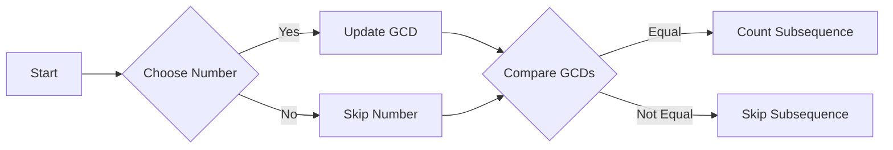

<h2><a href="https://leetcode.com/problems/find-the-number-of-subsequences-with-equal-gcd">3336. Find the Number of Subsequences With Equal GCD</a></h2>

<p>You are given an integer array <code>nums</code>.</p>

<p>Your task is to find the number of pairs of <strong>non-empty</strong> <span data-keyword="subsequence-array">subsequences</span> <code>(seq1, seq2)</code> of <code>nums</code> that satisfy the following conditions:</p>

<ul>
	<li>The subsequences <code>seq1</code> and <code>seq2</code> are <strong>disjoint</strong>, meaning <strong>no index</strong> of <code>nums</code> is common between them.</li>
	<li>The <span data-keyword="gcd-function">GCD</span> of the elements of <code>seq1</code> is equal to the GCD of the elements of <code>seq2</code>.</li>
</ul>

<p>Return the total number of such pairs.</p>

<p>Since the answer may be very large, return it <strong>modulo</strong> <code>10<sup>9</sup> + 7</code>.</p>

<p>&nbsp;</p>
<p><strong class="example">Example 1:</strong></p>

<div class="example-block">
<p><strong>Input:</strong> <span class="example-io">nums = [1,2,3,4]</span></p>

<p><strong>Output:</strong> <span class="example-io">10</span></p>

<p><strong>Explanation:</strong></p>

<p>The subsequence pairs which have the GCD of their elements equal to 1 are:</p>

<ul>
	<li><code>([<strong><u>1</u></strong>, 2, 3, 4], [1, <strong><u>2</u></strong>, <strong><u>3</u></strong>, 4])</code></li>
	<li><code>([<strong><u>1</u></strong>, 2, 3, 4], [1, <strong><u>2</u></strong>, <strong><u>3</u></strong>, <strong><u>4</u></strong>])</code></li>
	<li><code>([<strong><u>1</u></strong>, 2, 3, 4], [1, 2, <strong><u>3</u></strong>, <strong><u>4</u></strong>])</code></li>
	<li><code>([<strong><u>1</u></strong>, <strong><u>2</u></strong>, 3, 4], [1, 2, <strong><u>3</u></strong>, <strong><u>4</u></strong>])</code></li>
	<li><code>([<strong><u>1</u></strong>, 2, 3, <strong><u>4</u></strong>], [1, <strong><u>2</u></strong>, <strong><u>3</u></strong>, 4])</code></li>
	<li><code>([1, <strong><u>2</u></strong>, <strong><u>3</u></strong>, 4], [<strong><u>1</u></strong>, 2, 3, 4])</code></li>
	<li><code>([1, <strong><u>2</u></strong>, <strong><u>3</u></strong>, 4], [<strong><u>1</u></strong>, 2, 3, <strong><u>4</u></strong>])</code></li>
	<li><code>([1, <strong><u>2</u></strong>, <strong><u>3</u></strong>, <strong><u>4</u></strong>], [<strong><u>1</u></strong>, 2, 3, 4])</code></li>
	<li><code>([1, 2, <strong><u>3</u></strong>, <strong><u>4</u></strong>], [<strong><u>1</u></strong>, 2, 3, 4])</code></li>
	<li><code>([1, 2, <strong><u>3</u></strong>, <strong><u>4</u></strong>], [<strong><u>1</u></strong>, <strong><u>2</u></strong>, 3, 4])</code></li>
</ul>
</div>

<p><strong class="example">Example 2:</strong></p>

<div class="example-block">
<p><strong>Input:</strong> <span class="example-io">nums = [10,20,30]</span></p>

<p><strong>Output:</strong> <span class="example-io">2</span></p>

<p><strong>Explanation:</strong></p>

<p>The subsequence pairs which have the GCD of their elements equal to 10 are:</p>

<ul>
	<li><code>([<strong><u>10</u></strong>, 20, 30], [10, <strong><u>20</u></strong>, <strong><u>30</u></strong>])</code></li>
	<li><code>([10, <strong><u>20</u></strong>, <strong><u>30</u></strong>], [<strong><u>10</u></strong>, 20, 30])</code></li>
</ul>
</div>

<p><strong class="example">Example 3:</strong></p>

<div class="example-block">
<p><strong>Input:</strong> <span class="example-io">nums = [1,1,1,1]</span></p>

<p><strong>Output:</strong> <span class="example-io">50</span></p>
</div>

<p>&nbsp;</p>
<p><strong>Constraints:</strong></p>

<ul>
	<li><code>1 &lt;= nums.length &lt;= 200</code></li>
	<li><code>1 &lt;= nums[i] &lt;= 200</code></li>
</ul>


---

# 🛍️ Find-the-Number-of-Subsequences-With-Equal-GCD | Explained

## Approach 1: Dynamic Programming with Memoization
### Intuition
The core idea behind this approach is to use dynamic programming to store the results of subproblems and avoid redundant calculations. This works because the problem has overlapping subproblems, specifically when calculating the GCD of two numbers and considering whether to include the current number in the subsequence or not. The intuition is similar to a puzzle where each piece (number) has to be considered in the context of the entire picture (subsequence), and using memoization helps to remember how each piece fits into the larger puzzle.

### Algorithm Visualized

### Approach
The approach is to iterate over the array of numbers and for each number, consider two possibilities: including the current number in the subsequence or skipping it. When including the number, update the GCD of the subsequence if necessary. The base case is when all numbers have been considered, and if the GCDs of the two subsequences are equal, count this as a valid subsequence.

### Detailed Code Analysis
The provided code is a Java solution that uses a 3D array `dp` for memoization, where `dp[idx][g1][g2]` stores the number of subsequences starting from index `idx` with GCDs `g1` and `g2`. The `solve` method is recursive and takes the current index `idx`, the GCDs `g1` and `g2`, and the array of numbers `nums` as parameters.

- The `if (idx == n)` block checks if all numbers have been considered and returns 1 if the GCDs are equal and 0 otherwise.
- The `if (dp[idx][g1][g2] != -1)` block checks if the result for the current subproblem is already stored in the `dp` array and returns it if so.
- The `long ans = 0;` line initializes a variable to store the total number of subsequences.
- The `ans = solve(idx + 1, g1, g2, nums);` line recursively calls the `solve` method without including the current number in the subsequence.
- The `int ng1 = (g1 == 0) ? nums[idx] : gcd(g1, nums[idx]);` and `int ng2 = (g2 == 0) ? nums[idx] : gcd(g2, nums[idx]);` lines update the GCDs if the current number is included in the subsequence.
- The `ans = (ans + solve(idx + 1, ng1, g2, nums)) % MOD;` and `ans = (ans + solve(idx + 1, g1, ng2, nums)) % MOD;` lines recursively call the `solve` method with the updated GCDs and add the results to `ans`.
- The `return dp[idx][g1][g2] = (int) ans;` line stores the result in the `dp` array and returns it.

### Code
```java
class Solution {
    private static final int MOD = 1_000_000_007;
    private int n;
    private int[][][] dp;

    private int solve(int idx, int g1, int g2, int[] nums) {
        if (idx == n) {
            return (g1 != 0 && g1 == g2) ? 1 : 0;
        }

        if (dp[idx][g1][g2] != -1)
            return dp[idx][g1][g2];

        long ans = 0;
        ans = solve(idx + 1, g1, g2, nums);

        int ng1 = (g1 == 0) ? nums[idx] : gcd(g1, nums[idx]);
        ans = (ans + solve(idx + 1, ng1, g2, nums)) % MOD;

        int ng2 = (g2 == 0) ? nums[idx] : gcd(g2, nums[idx]);
        ans = (ans + solve(idx + 1, g1, ng2, nums)) % MOD;

        return dp[idx][g1][g2] = (int) ans;
    }

    public int subsequencePairCount(int[] nums) {
        n = nums.length;
        dp = new int[n + 1][201][201];

        for (int i = 0; i <= n; i++) {
            for (int j = 0; j <= 200; j++) {
                Arrays.fill(dp[i][j], -1);
            }
        }

        return solve(0, 0, 0, nums);
    }

    private int gcd(int a, int b) {
        while (b != 0) {
            int t = a % b;
            a = b;
            b = t;
        }
        return a;
    }
}
```
### Complexity
- **Time:** The time complexity is O(n \* 201 \* 201), where n is the length of the input array, due to the three nested loops in the recursive `solve` method.
- **Space:** The space complexity is O(n \* 201 \* 201), where n is the length of the input array, due to the 3D `dp` array used for memoization.

## 🕵️‍♂️ Follow-up Questions (Optional)
1. How would you optimize the solution for very large input arrays?
   Answer: To optimize the solution for very large input arrays, we could consider using a more efficient data structure, such as a hash map, to store the memoized results, or using approximate algorithms that can handle large inputs.
2. How would you modify the solution to find the number of subsequences with a GCD greater than a given threshold?
   Answer: To modify the solution to find the number of subsequences with a GCD greater than a given threshold, we could modify the base case of the recursive `solve` method to return 1 only if the GCD of the two subsequences is greater than the threshold.