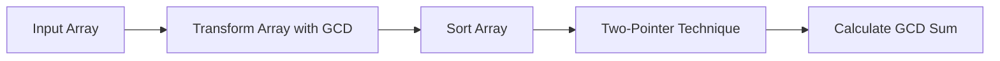

<h2><a href="https://leetcode.com/problems/sum-of-gcd-of-formed-pairs">3867. Sum of GCD of Formed Pairs</a></h2>

<p>You are given an integer array <code>nums</code> of length <code>n</code>.</p>

<p>Construct an array <code>prefixGcd</code> where for each index <code>i</code>:</p>

<ul>
	<li>Let <code>mx<sub>i</sub> = max(nums[0], nums[1], ..., nums[i])</code>.</li>
	<li><code>prefixGcd[i] = gcd(nums[i], mx<sub>i</sub>)</code>.</li>
</ul>

<p>After constructing <code>prefixGcd</code>:</p>

<ul>
	<li>Sort <code>prefixGcd</code> in <strong>non-decreasing</strong> order.</li>
	<li>Form pairs by taking the <strong>smallest unpaired</strong> element and the <strong>largest unpaired</strong> element.</li>
	<li>Repeat this process until no more pairs can be formed.</li>
	<li>For each formed pair, <strong>compute</strong> the <code>gcd</code> of the two elements.</li>
	<li>If <code>n</code> is odd, the <strong>middle</strong> element in the <code>prefixGcd</code> array remains <strong>unpaired</strong> and should be ignored.</li>
</ul>

<p>Return an integer denoting the <strong>sum of the GCD</strong> values of all formed pairs.</p>
The term <code>gcd(a, b)</code> denotes the <strong>greatest common divisor</strong> of <code>a</code> and <code>b</code>.
<p>&nbsp;</p>
<p><strong class="example">Example 1:</strong></p>

<div class="example-block">
<p><strong>Input:</strong> <span class="example-io">nums = [2,6,4]</span></p>

<p><strong>Output:</strong> <span class="example-io">2</span></p>

<p><strong>Explanation:</strong></p>

<p>Construct <code>prefixGcd</code>:</p>

<table style="border: 1px solid black;"><thead><tr><th style="border: 1px solid black;"><code>i</code></th><th style="border: 1px solid black;"><code>nums[i]</code></th><th style="border: 1px solid black;"><code>mx<sub>i</sub></code></th><th style="border: 1px solid black;"><code>prefixGcd[i]</code></th></tr></thead><tbody><tr><td style="border: 1px solid black;">0</td><td style="border: 1px solid black;">2</td><td style="border: 1px solid black;">2</td><td style="border: 1px solid black;">2</td></tr><tr><td style="border: 1px solid black;">1</td><td style="border: 1px solid black;">6</td><td style="border: 1px solid black;">6</td><td style="border: 1px solid black;">6</td></tr><tr><td style="border: 1px solid black;">2</td><td style="border: 1px solid black;">4</td><td style="border: 1px solid black;">6</td><td style="border: 1px solid black;">2</td></tr></tbody></table>

<p><code>prefixGcd = [2, 6, 2]</code>. After sorting, it forms <code>[2, 2, 6]</code>.</p>

<p>Pair the smallest and largest elements: <code>gcd(2, 6) = 2</code>. The remaining middle element 2 is ignored. Thus, the sum is 2.</p>
</div>

<p><strong class="example">Example 2:</strong></p>

<div class="example-block">
<p><strong>Input:</strong> <span class="example-io">nums = [3,6,2,8]</span></p>

<p><strong>Output:</strong> <span class="example-io">5</span></p>

<p><strong>Explanation:</strong></p>

<p>Construct <code>prefixGcd</code>:</p>

<table style="border: 1px solid black;"><thead><tr><th style="border: 1px solid black;"><code>i</code></th><th style="border: 1px solid black;"><code>nums[i]</code></th><th style="border: 1px solid black;"><code>mx<sub>i</sub></code></th><th style="border: 1px solid black;"><code>prefixGcd[i]</code></th></tr></thead><tbody><tr><td style="border: 1px solid black;">0</td><td style="border: 1px solid black;">3</td><td style="border: 1px solid black;">3</td><td style="border: 1px solid black;">3</td></tr><tr><td style="border: 1px solid black;">1</td><td style="border: 1px solid black;">6</td><td style="border: 1px solid black;">6</td><td style="border: 1px solid black;">6</td></tr><tr><td style="border: 1px solid black;">2</td><td style="border: 1px solid black;">2</td><td style="border: 1px solid black;">6</td><td style="border: 1px solid black;">2</td></tr><tr><td style="border: 1px solid black;">3</td><td style="border: 1px solid black;">8</td><td style="border: 1px solid black;">8</td><td style="border: 1px solid black;">8</td></tr></tbody></table>

<p><code>prefixGcd = [3, 6, 2, 8]</code>. After sorting, it forms <code>[2, 3, 6, 8]</code>.</p>

<p>Form pairs: <code>gcd(2, 8) = 2</code> and <code>gcd(3, 6) = 3</code>. Thus, the sum is <code>2 + 3 = 5</code>.</p>
</div>

<p>&nbsp;</p>
<p><strong>Constraints:</strong></p>

<ul>
	<li><code>1 &lt;= n == nums.length &lt;= 10<sup>5</sup></code></li>
	<li><code>1 &lt;= nums[i] &lt;= 10<sup>​​​​​​​9</sup></code></li>
</ul>


---

# 🛍️ Sum-of-GCD-of-Formed-Pairs | Explained

## Approach 1: GCD Sum Calculation with Two-Pointer Technique
### Intuition
This approach works by first transforming the input array to contain the GCD of each element with the maximum element seen so far. Then, it sorts the array and uses the two-pointer technique to calculate the sum of the GCDs of formed pairs. The idea is to consider all possible pairs of elements in the array, calculate their GCD, and sum them up. The transformation step and sorting facilitate efficient pair formation.

### Algorithm Visualized


### Approach
The algorithm can be broken down into three main steps:
1. Transform the input array by replacing each element with the GCD of the element and the maximum element seen so far. This step ensures that each element in the array is the GCD of the original element and the maximum element.
2. Sort the transformed array in ascending order.
3. Apply the two-pointer technique to the sorted array. Start from both ends of the array and move the pointers towards the center, calculating the GCD of the elements at the current positions and adding it to the sum.

### Detailed Code Analysis
Let's break down the code:
- `int n = nums.length;` stores the length of the input array in the variable `n`.
- `int mx = 0;` initializes a variable `mx` to store the maximum element seen so far.
- The first `for` loop iterates over the input array. For each element, it calculates the GCD of the element and the current maximum `mx` using the `gcd` method and assigns it back to the current element. This transforms the array.
- `Arrays.sort(nums);` sorts the transformed array in ascending order.
- `int left = 0, right = n - 1;` initializes two pointers, `left` at the start of the array and `right` at the end.
- The `while` loop applies the two-pointer technique. It calculates the GCD of the elements at the current positions of `left` and `right` using the `gcd` method and adds it to the `ans` sum.
- The loop continues until `left` is no longer less than `right`, effectively covering all pairs of elements in the sorted array.

### Code
```java
class Solution {
    public long gcdSum(int[] nums) {
        int n = nums.length;
        int mx = 0;
        
        for (int i = 0; i < n; i++) {
            mx = Math.max(mx, nums[i]);
            nums[i] = gcd(mx, nums[i]);
        }
        
        Arrays.sort(nums);
        
        int left = 0, right = n - 1;
        long ans = 0;
        
        while (left < right) {
            ans += gcd(nums[left], nums[right]);
            left++;
            right--;
        }
        
        return ans;
    }
    
    private int gcd(int a, int b) {
        while (b != 0) {
            int t = a % b;
            a = b;
            b = t;
        }
        return a;
    }
}
```

### Complexity
- **Time:** The time complexity is O(n log n) due to the sorting operation. The initial `for` loop takes O(n) time, the sorting operation takes O(n log n) time, and the two-pointer technique takes O(n) time. Hence, the overall time complexity is dominated by the sorting operation.
- **Space:** The space complexity is O(1) if we consider the space required for the output and the space used by the input array. The sorting operation is in-place, and the two-pointer technique uses a constant amount of space. However, the `gcd` method uses a constant amount of space as well. If we consider the space required for the recursive call stack in the worst case, the space complexity would be O(log n) due to the recursive calls in the `gcd` method. But in this case, the `gcd` method is iterative, so the space complexity remains O(1).

## 🕵️‍♂️ Follow-up Questions (Optional)
1. How would you optimize the solution if the input array is very large and does not fit into memory?
   - One possible approach is to use a streaming algorithm that processes the input array in chunks, calculates the GCD for each chunk, and then combines the results.
2. Can you modify the solution to calculate the sum of LCMs (Least Common Multiples) instead of GCDs?
   - Yes, you can modify the solution by replacing the `gcd` method with an `lcm` method. The `lcm` method can be implemented using the formula `lcm(a, b) = (a * b) / gcd(a, b)`.