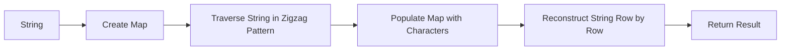

<h2><a href="https://leetcode.com/problems/zigzag-conversion">6. Zigzag Conversion</a></h2>

<p>The string <code>"PAYPALISHIRING"</code> is written in a zigzag pattern on a given number of rows like this: (you may want to display this pattern in a fixed font for better legibility)</p>

<pre>P   A   H   N
A P L S I I G
Y   I   R
</pre>

<p>And then read line by line: <code>"PAHNAPLSIIGYIR"</code></p>

<p>Write the code that will take a string and make this conversion given a number of rows:</p>

<pre>string convert(string s, int numRows);
</pre>

<p>&nbsp;</p>
<p><strong class="example">Example 1:</strong></p>

<pre><strong>Input:</strong> s = "PAYPALISHIRING", numRows = 3
<strong>Output:</strong> "PAHNAPLSIIGYIR"
</pre>

<p><strong class="example">Example 2:</strong></p>

<pre><strong>Input:</strong> s = "PAYPALISHIRING", numRows = 4
<strong>Output:</strong> "PINALSIGYAHRPI"
<strong>Explanation:</strong>
P     I    N
A   L S  I G
Y A   H R
P     I
</pre>

<p><strong class="example">Example 3:</strong></p>

<pre><strong>Input:</strong> s = "A", numRows = 1
<strong>Output:</strong> "A"
</pre>

<p>&nbsp;</p>
<p><strong>Constraints:</strong></p>

<ul>
	<li><code>1 &lt;= s.length &lt;= 1000</code></li>
	<li><code>s</code> consists of English letters (lower-case and upper-case), <code>','</code> and <code>'.'</code>.</li>
	<li><code>1 &lt;= numRows &lt;= 1000</code></li>
</ul>


---

# 🛍️ Zigzag-Conversion | Explained

## Approach 1: Map-Based Zigzag Conversion
### Intuition
The core idea behind this approach is to utilize a map to store characters at their respective row positions as we traverse the string in a zigzag pattern. This approach works by effectively distributing characters across rows and then reconstructing the string in the correct order. It's akin to having multiple buckets (rows) where we drop characters in sequence, following the zigzag pattern, and then read them out row by row.

### Algorithm Visualized


### Approach
The approach involves:
1. Handling edge cases where the number of rows is 1 or greater than or equal to the string length, in which case the string remains unchanged.
2. Creating a map to store characters for each row.
3. Iterating through the string, distributing characters across rows in a zigzag pattern.
4. Constructing the final string by concatenating characters from each row in order.

### Detailed Code Analysis
- The code begins by checking if `numRows` is 1 or if it's greater than or equal to the length of the string `s`. If either condition is true, it returns the original string, as the zigzag conversion does not apply.
- It then converts the string `s` into a character array `chars`.
- A `Map<Integer, String>` named `result` is used to store the characters for each row, where the key represents the row number and the value is a string of characters in that row.
- The code initializes `row` to 1 (since rows are 1-indexed in this implementation) and a boolean `up` to true, indicating the initial direction of the zigzag (going down).
- It then iterates through each character in the string, appending it to the corresponding row in the `result` map. The `merge` function is used with `String::concat` to concatenate the new character to the existing string in the map for the current row.
- The code updates the `row` and `up` variables based on the current direction and position. When `row` reaches the top or bottom, the direction (`up`) is reversed.
- After distributing all characters across the rows, it uses a `StringBuilder` to construct the final string. It iterates from 1 to `numRows`, appending the characters from each row in the `result` map to the `StringBuilder`.
- Finally, the code returns the resulting string, which is the zigzag-converted version of the input string.

### Code
```java
class Solution {
    public String convert(String s, int numRows) {
        int size = s.length();
        if (numRows == 1 || numRows >= size) {
            return s;
        }
        char[] chars = s.toCharArray();

        Map<Integer, String> result = new HashMap<>();
        int row = 1;
        boolean up = true;
        for (int i = 0; i < s.length(); i++) {
            result.merge(row, String.valueOf(chars[i]), String::concat);
            if (up) {
                row++;
            } else {
                row--;
            }
            if (row == numRows || row == 1) {
                up = !up;
            }
        }

        StringBuilder sb = new StringBuilder();
        for (int i = 0; i < numRows; i++) {
            sb.append(result.get(i + 1));
        }
        return sb.toString();
    }
}
```

### Complexity
- **Time:** The time complexity of this solution is O(n), where n is the length of the string `s`. This is because the solution involves a single pass through the string to distribute characters across rows and another pass to reconstruct the string from the map. The operations within these passes (map lookups, string concatenations) are generally constant time or linear, depending on the implementation details of the map and string classes.
- **Space:** The space complexity is O(n), where n is the length of the string `s`. This is because in the worst-case scenario (when `numRows` is 1 or when the string length is less than or equal to `numRows`), the map could potentially store every character from the string, resulting in a space complexity proportional to the input size. Additionally, the `StringBuilder` used to reconstruct the final string also requires O(n) space.