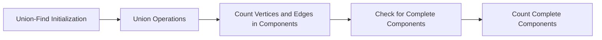

<h2><a href="https://leetcode.com/problems/count-the-number-of-complete-components">2685. Count the Number of Complete Components</a></h2>

<p>You are given an integer <code>n</code>. There is an <strong>undirected</strong> graph with <code>n</code> vertices, numbered from <code>0</code> to <code>n - 1</code>. You are given a 2D integer array <code>edges</code> where <code>edges[i] = [a<sub>i</sub>, b<sub>i</sub>]</code> denotes that there exists an <strong>undirected</strong> edge connecting vertices <code>a<sub>i</sub></code> and <code>b<sub>i</sub></code>.</p>

<p>Return <em>the number of <strong>complete connected components</strong> of the graph</em>.</p>

<p>A <strong>connected component</strong> is a subgraph of a graph in which there exists a path between any two vertices, and no vertex of the subgraph shares an edge with a vertex outside of the subgraph.</p>

<p>A connected component is said to be <b>complete</b> if there exists an edge between every pair of its vertices.</p>

<p>&nbsp;</p>
<p><strong class="example">Example 1:</strong></p>

<p><strong class="example"></strong></p>

<pre><strong>Input:</strong> n = 6, edges = [[0,1],[0,2],[1,2],[3,4]]
<strong>Output:</strong> 3
<strong>Explanation:</strong> From the picture above, one can see that all of the components of this graph are complete.
</pre>

<p><strong class="example">Example 2:</strong></p>

<p><strong class="example"></strong></p>

<pre><strong>Input:</strong> n = 6, edges = [[0,1],[0,2],[1,2],[3,4],[3,5]]
<strong>Output:</strong> 1
<strong>Explanation:</strong> The component containing vertices 0, 1, and 2 is complete since there is an edge between every pair of two vertices. On the other hand, the component containing vertices 3, 4, and 5 is not complete since there is no edge between vertices 4 and 5. Thus, the number of complete components in this graph is 1.
</pre>

<p>&nbsp;</p>
<p><strong>Constraints:</strong></p>

<ul>
	<li><code>1 &lt;= n &lt;= 50</code></li>
	<li><code>0 &lt;= edges.length &lt;= n * (n - 1) / 2</code></li>
	<li><code>edges[i].length == 2</code></li>
	<li><code>0 &lt;= a<sub>i</sub>, b<sub>i</sub> &lt;= n - 1</code></li>
	<li><code>a<sub>i</sub> != b<sub>i</sub></code></li>
	<li>There are no repeated edges.</li>
</ul>


---

# 🛍️ Count-the-Number-of-Complete-Components | Explained

## Approach 1: Union-Find with Complete Component Counting
### Intuition
The approach works by utilizing a Union-Find data structure to group connected vertices into components. The intuition is to first connect all the vertices based on the given edges, then calculate the number of vertices and edges in each component, and finally check if each component is a complete subgraph (i.e., every pair of vertices in the component is connected by an edge). This approach works because a complete subgraph has a specific number of edges (n*(n-1)/2) given a certain number of vertices (n).

### Algorithm Visualized


### Approach
The algorithmic steps are as follows:
1. Initialize a Union-Find data structure with n vertices.
2. Perform union operations based on the given edges to connect the vertices into components.
3. Count the number of vertices in each component.
4. Count the number of edges in each component.
5. Check if each component is a complete subgraph by verifying if the number of edges is equal to n*(n-1)/2 for that component.
6. Count the number of complete components.

### Detailed Code Analysis
The provided code initializes a `DisjointSetPotd` object, which represents the Union-Find data structure. The `DisjointSetPotd` class has two main methods: `findParent` and `unionByRank`. The `findParent` method is used to find the root of a vertex, and the `unionByRank` method is used to connect two vertices into the same component. The code then iterates over the edges and performs union operations to connect the vertices into components.

The code then counts the number of vertices in each component by iterating over all vertices and finding their roots using the `findParent` method. It also counts the number of edges in each component by iterating over the edges and finding their roots.

Finally, the code checks if each component is a complete subgraph by verifying if the number of edges is equal to n*(n-1)/2 for that component. If a component is complete, it increments the count of complete components.

### Code
```java
class Solution {
    public int countCompleteComponents(int n, int[][] edges) {
        DisjointSetPotd dsj = new DisjointSetPotd(n);
        for (int[] row : edges) {
            dsj.unionByRank(row[0], row[1]);
        }
        int ans = 0;
        for (int i = 0; i < n; i++) {
            dsj.findParent(i);
        }
        Map<Integer, Integer> vertex = new HashMap<>();
        Map<Integer, Integer> edgeCount = new HashMap<>();
        for (int i = 0; i < n; i++) {
            int root = dsj.parent[i];
            vertex.put(root, vertex.getOrDefault(root, 0) + 1);
        }
        for (int[] row : edges) {
            int root = dsj.findParent(row[0]);
            edgeCount.put(root, edgeCount.getOrDefault(root, 0) + 1);
        }
        for (int root : vertex.keySet()) {
            int v = vertex.get(root);
            int e = edgeCount.getOrDefault(root, 0);
            if (e == v * (v - 1) / 2) ans++;
        }
        return ans;
    }

    public static class DisjointSetPotd {
        int[] rank;
        int[] parent;

        DisjointSetPotd(int n) {
            rank = new int[n];
            parent = new int[n];
            for (int i = 0; i < n; i++) {
                rank[i] = 0;
                parent[i] = i;
            }
        }

        public int findParent(int node) {
            if (node == parent[node]) return node;
            int ultimateParent = findParent(parent[node]);
            parent[node] = ultimateParent;
            return parent[node];
        }

        public void unionByRank(int u, int v) {
            int pu = findParent(u);
            int pv = findParent(v);
            if (pu == pv) return;
            if (rank[pv] < rank[pu]) {
                parent[pv] = pu;
            } else if (rank[pv] > rank[pu]) {
                parent[pu] = pv;
            } else {
                parent[pv] = pu;
                int rankU = rank[pu];
                rank[pu] = rankU + 1;
            }
        }
    }
}
```

### Complexity
- **Time:** O(n + m * alpha(n)) where n is the number of vertices, m is the number of edges, and alpha(n) is the inverse Ackermann function, which grows very slowly. The time complexity is dominated by the Union-Find operations.
- **Space:** O(n + m) for storing the Union-Find data structure, vertices, and edges. The space complexity is linear with respect to the input size.

## 🕵️‍♂️ Follow-up Questions (Optional)
1. What if the input graph is very large and cannot fit in memory? How would you modify the algorithm to handle such a case?
   Answer: You can modify the algorithm to use a disk-based Union-Find data structure or to process the graph in chunks, handling each chunk individually.
2. Can you optimize the algorithm further by reducing the number of Union-Find operations?
   Answer: Yes, you can optimize the algorithm by using a more efficient Union-Find data structure, such as a Union-Find with path compression and union by rank, or by using a different approach, such as a graph traversal algorithm.