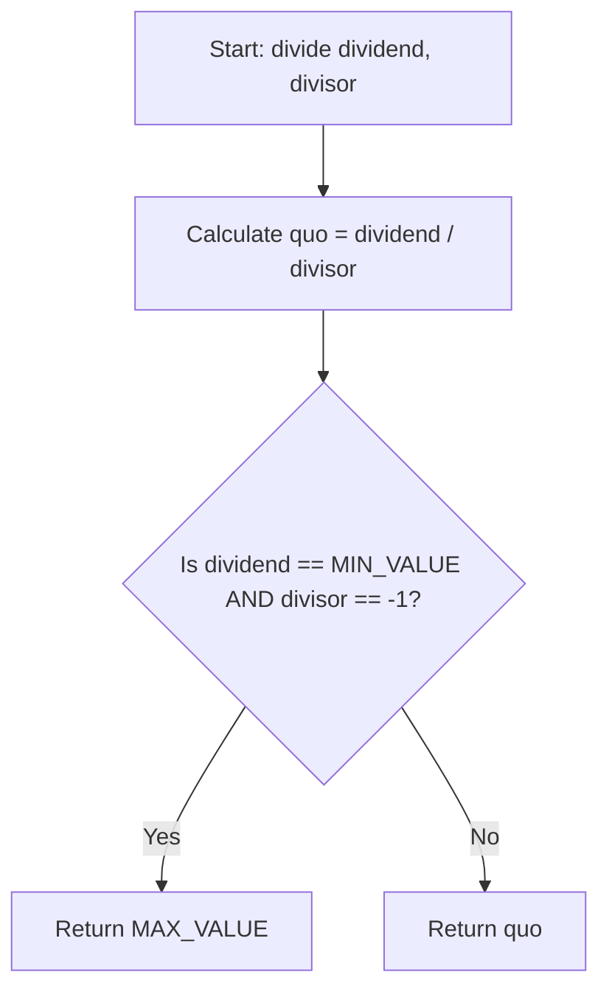

<h2><a href="https://leetcode.com/problems/divide-two-integers">190. Reverse Bits</a></h2>

<p>Given two integers <code>dividend</code> and <code>divisor</code>, divide two integers <strong>without</strong> using multiplication, division, and mod operator.</p>

<p>The integer division should truncate toward zero, which means losing its fractional part. For example, <code>8.345</code> would be truncated to <code>8</code>, and <code>-2.7335</code> would be truncated to <code>-2</code>.</p>

<p>Return <em>the <strong>quotient</strong> after dividing </em><code>dividend</code><em> by </em><code>divisor</code>.</p>

<p><strong>Note: </strong>Assume we are dealing with an environment that could only store integers within the <strong>32-bit</strong> signed integer range: <code>[&minus;2<sup>31</sup>, 2<sup>31</sup> &minus; 1]</code>. For this problem, if the quotient is <strong>strictly greater than</strong> <code>2<sup>31</sup> - 1</code>, then return <code>2<sup>31</sup> - 1</code>, and if the quotient is <strong>strictly less than</strong> <code>-2<sup>31</sup></code>, then return <code>-2<sup>31</sup></code>.</p>

<p>&nbsp;</p>
<p><strong class="example">Example 1:</strong></p>

<pre>
<strong>Input:</strong> dividend = 10, divisor = 3
<strong>Output:</strong> 3
<strong>Explanation:</strong> 10/3 = 3.33333.. which is truncated to 3.
</pre>

<p><strong class="example">Example 2:</strong></p>

<pre>
<strong>Input:</strong> dividend = 7, divisor = -3
<strong>Output:</strong> -2
<strong>Explanation:</strong> 7/-3 = -2.33333.. which is truncated to -2.
</pre>

<p>&nbsp;</p>
<p><strong>Constraints:</strong></p>

<ul>
	<li><code>-2<sup>31</sup> &lt;= dividend, divisor &lt;= 2<sup>31</sup> - 1</code></li>
	<li><code>divisor != 0</code></li>
</ul>


---

# 🛍️ Reverse-Bits | Explained

## Approach 1: Direct Division with Post-Overflow Handling
### Intuition
The core idea of this approach is to perform standard integer division using the native division operator (`/`) and then handle the single edge case where 32-bit signed integer overflow occurs. In a 32-bit signed integer environment, the range of representable values is $[-2^{31}, 2^{31} - 1]$ (or `[-2147483648, 2147483647]`). The only scenario where division overflows this range is when dividing the minimum possible value (`Integer.MIN_VALUE`) by `-1`, which mathematically yields $2^{31}$ (exceeding the maximum limit by 1).

### Algorithm Visualized


### Approach
1. **Calculate the Quotient**: Perform the division directly using the native `/` operator and store the result in the variable `quo`.
2. **Check for Overflow**: Evaluate if the input parameters match the specific overflow condition where `dividend` is `Integer.MIN_VALUE` and `divisor` is `-1`.
3. **Return Result**: If the overflow condition is met, return `Integer.MAX_VALUE` ($2^{31} - 1$). Otherwise, return the pre-calculated `quo`.

### Detailed Code Analysis
- **Line 3 (`int quo = dividend / divisor;`)**: This line executes the division using Java's built-in division operator. In Java, dividing `Integer.MIN_VALUE` by `-1` does not throw a hardware or arithmetic exception; instead, it silently overflows and wraps back to `Integer.MIN_VALUE` due to 32-bit two's complement arithmetic limits.
- **Lines 4–6 (`if(dividend==Integer.MIN_VALUE && divisor==-1) { return Integer.MAX_VALUE; }`)**: This conditional block guards against the 32-bit overflow limit. By checking the inputs after the calculation, it corrects the wrapped-around result to the maximum representable 32-bit integer (`Integer.MAX_VALUE`).
- **Line 8 (`return quo;`)**: If the inputs do not cause an overflow, the computed quotient is returned directly.

### Code
```java
class Solution {
    public int divide(int dividend, int divisor) {
        int quo = dividend / divisor;
        if(dividend==Integer.MIN_VALUE && divisor==-1){
            return Integer.MAX_VALUE;
        }
        return quo;
    }
}
```

### Complexity
- **Time:** $\mathcal{O}(1)$ — The division operation and the conditional checks run in constant time.
- **Space:** $\mathcal{O}(1)$ — Only a single integer variable `quo` is allocated, requiring constant auxiliary space.

## 🕵️‍♂️ Follow-up Questions (Optional)
1. **Why does dividing `Integer.MIN_VALUE` by `-1` overflow?**
   In 32-bit signed two's complement representation, the minimum value is $-2^{31}$ (`-2147483648`) and the maximum value is $2^{31} - 1$ (`2147483647`). Dividing $-2^{31}$ by $-1$ results in $+2^{31}$, which is exactly $1$ greater than the maximum representable positive integer, causing an arithmetic overflow.

2. **Is it safe to perform the division before checking for overflow?**
   While Java allows division overflow to occur silently by wrapping the value around, in other systems or languages like C/C++, dividing `INT_MIN` by `-1` triggers undefined behavior or causes a critical runtime exception (such as `SIGFPE`). To make the code robust and portable across languages, the overflow check should always be performed *before* the division occurs.