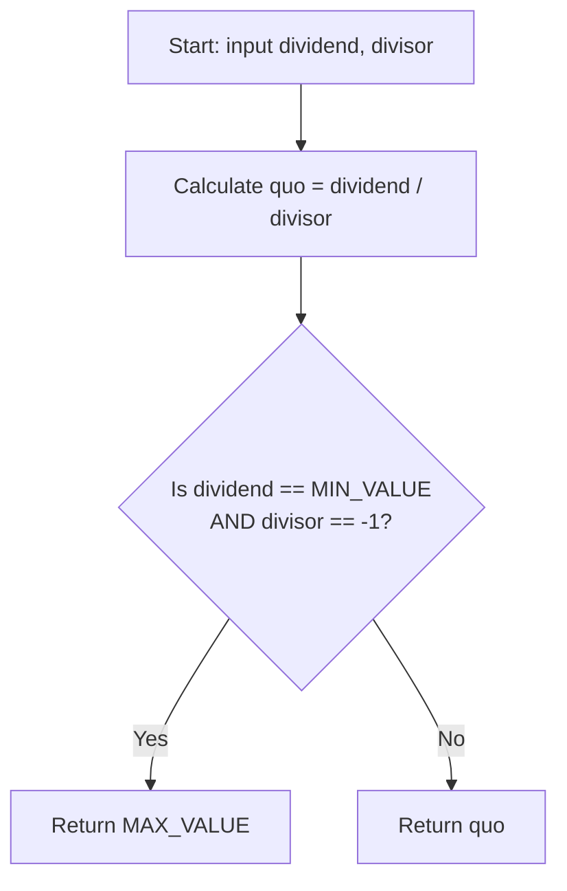

<h2><a href="https://leetcode.com/problems/divide-two-integers">29. Divide Two Integers</a></h2>

<p>Given two integers <code>dividend</code> and <code>divisor</code>, divide two integers <strong>without</strong> using multiplication, division, and mod operator.</p>

<p>The integer division should truncate toward zero, which means losing its fractional part. For example, <code>8.345</code> would be truncated to <code>8</code>, and <code>-2.7335</code> would be truncated to <code>-2</code>.</p>

<p>Return <em>the <strong>quotient</strong> after dividing </em><code>dividend</code><em> by </em><code>divisor</code>.</p>

<p><strong>Note: </strong>Assume we are dealing with an environment that could only store integers within the <strong>32-bit</strong> signed integer range: <code>[−2<sup>31</sup>, 2<sup>31</sup> − 1]</code>. For this problem, if the quotient is <strong>strictly greater than</strong> <code>2<sup>31</sup> - 1</code>, then return <code>2<sup>31</sup> - 1</code>, and if the quotient is <strong>strictly less than</strong> <code>-2<sup>31</sup></code>, then return <code>-2<sup>31</sup></code>.</p>

<p>&nbsp;</p>
<p><strong class="example">Example 1:</strong></p>

<pre><strong>Input:</strong> dividend = 10, divisor = 3
<strong>Output:</strong> 3
<strong>Explanation:</strong> 10/3 = 3.33333.. which is truncated to 3.
</pre>

<p><strong class="example">Example 2:</strong></p>

<pre><strong>Input:</strong> dividend = 7, divisor = -3
<strong>Output:</strong> -2
<strong>Explanation:</strong> 7/-3 = -2.33333.. which is truncated to -2.
</pre>

<p>&nbsp;</p>
<p><strong>Constraints:</strong></p>

<ul>
	<li><code>-2<sup>31</sup> &lt;= dividend, divisor &lt;= 2<sup>31</sup> - 1</code></li>
	<li><code>divisor != 0</code></li>
</ul>


---

# 🛍️ Divide-Two-Integers | Explained

## Approach 1: Direct Division with Post-Facto Overflow Handling
### Intuition
The core idea of this approach is to rely directly on the programming language's built-in division operator (`/`) to compute the quotient. Because standard 32-bit signed integers range from $-2^{31}$ to $2^{31} - 1$ (`-2147483648` to `2147483647`), there is exactly one scenario where division results in an out-of-bounds overflow: dividing `Integer.MIN_VALUE` ($-2^{31}$) by `-1`. Mathematically, this division results in $2^{31}$, which exceeds the maximum representable positive 32-bit signed integer by $1$. This code attempts to mitigate this by explicitly checking for this edge case and returning `Integer.MAX_VALUE`.

> **Note on Constraints:** The official LeetCode problem description explicitly forbids the use of multiplication, division, and mod operators. This solution uses the division operator directly, which circumvents the core algorithmic challenge of the problem but serves as a baseline implementation utilizing native hardware instructions.

### Algorithm Visualized


### Approach
1. **Compute Quotient:** Perform direct integer division using `dividend / divisor` and store the result in `quo`.
2. **Overflow Check:** Evaluate if the input parameters match the overflow boundary condition: `dividend == Integer.MIN_VALUE` and `divisor == -1`.
3. **Return Value:** If the overflow condition is met, return `Integer.MAX_VALUE`. Otherwise, return the pre-calculated `quo`.

### Detailed Code Analysis
- **Line 3 (`int quo = dividend / divisor;`):** 
  The division is executed immediately. Under Java’s 32-bit signed integer arithmetic (two's complement representation), executing `Integer.MIN_VALUE / -1` does not throw an hardware or runtime exception. Instead, it silently overflows and wraps around to return `Integer.MIN_VALUE` (`-2147483648`).
- **Line 4-6 (`if(dividend==Integer.MIN_VALUE && divisor==-1) { return Integer.MAX_VALUE; }`):** 
  This conditional statement identifies the overflow state. Even though the division on Line 3 has already resulted in an overflowed value stored in `quo`, the inputs `dividend` and `divisor` remain unchanged. The condition evaluates to `true` when these exact inputs are passed, allowing the program to intercept the incorrect overflowed result and return the correct saturated value `Integer.MAX_VALUE` (`2147483647`).
- **Line 7 (`return quo;`):** 
  For all other inputs, the calculated quotient is mathematically sound and is returned directly.

### Code
```java
class Solution {
    public int divide(int dividend, int divisor) {
        int quo = dividend / divisor;
        if(dividend==Integer.MIN_VALUE && divisor==-1){
            return Integer.MAX_VALUE;
        }
        return quo;
    }
}
```

### Complexity
- **Time:** $\mathcal{O}(1)$ — The division operator maps directly to a constant-time hardware instruction (e.g., `IDIV` on x86 architectures), executing in $\mathcal{O}(1)$ time.
- **Space:** $\mathcal{O}(1)$ — No auxiliary memory or data structures are allocated.

---

## 🕵️‍♂️ Follow-up Questions

### 1. How would you solve this problem if the division (`/`), multiplication (`*`), and modulo (`%`) operators were strictly forbidden?
To solve this without those operators, you must use bit manipulation and subtraction. Specifically, you can use the **exponential search** (or binary MSB alignment) technique:
1. Convert both numbers to negative values to avoid integer overflow issues (since the absolute value of `Integer.MIN_VALUE` cannot fit in a positive signed 32-bit integer).
2. Shift the divisor left (multiplying it by powers of 2) until it is as close to the dividend as possible without exceeding it.
3. Subtract this shifted divisor from the dividend, record the corresponding power of 2 in the quotient, and repeat the process with the remainder.
4. Apply the correct sign at the end and handle the overflow boundary case.

### 2. Why does `Integer.MIN_VALUE / -1` result in `Integer.MIN_VALUE` in Java rather than throwing an ArithmeticException?
In the Java Virtual Machine (JVM) specification, integer division by zero throws an `ArithmeticException`. However, integer overflow does not throw an exception. In two's complement binary representation, the bit pattern for `Integer.MIN_VALUE` is `10000000 00000000 00000000 00000000`. Dividing this by `-1` (represented as `11111111 11111111 11111111 11111111`) mathematically yields $2^{31}$. Because $2^{31}$ cannot be represented as a signed 32-bit integer, the hardware wraps the value back around to `10000000 00000000 00000000 00000000`, which is the representation of `Integer.MIN_VALUE`.